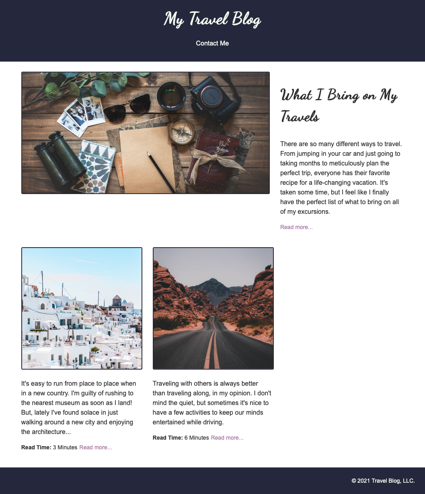

# Creating and Updating DOM Elements

Use this travel blog website to practice reading and deleting elements from the DOM.

---

## Lab Setup

### Getting started

1. Fork and clone this repository.

1. Navigate to the `settings` tab on GitHub, then choose `Pages` from the menu. Configure the `Build and Deployment` to have a `Source` of `Deploy from a branch` and select the `main` branch for deployment. Deployments can take a few minutes, so get started on the lab, and then be sure to check the deployment after you have made a few commits.

1. Open up the repository in VSCode. Follow the instructions below to complete the Lab.

## Instructions

Begin by creating a `main.js` file. Then, connect that file to the `index.html` file.

To complete this lab, you will need to create and update a number of elements using JavaScript. You _should not_ edit the HTML at all. You can see what the final view of the web page should be at the bottom of this document.

- [ ] Add a class of "featured" to the first `section` element on the page.
- [ ] Create the following `article` element with JavaScript and add at the end of the `section.posts` element.

```html
<article>
  
  <h3>Stop Planning</h3>
  <p>
    You -- yes you! You're an over-planner, I can tell. It's time to stop
    planning so much and instead focusing on relaxing. Taking a break at all is
    so stressful these days; why add to the stress by overworking yourself?
  </p>
  <aside>
    <p>
      <span><strong>Read Time:</strong> 4 Minutes</span
      ><a href="#">Read more...</a>
    </p>
  </aside>
</article>
```

- [ ] Move the first article from inside the `section.posts` element to become the second article and move the second article so that it is the first article.

- [ ] Remove the "All Posts" link from the header.
- [ ] Remove the `span` element that contains the "Read Time" in the featured post. The featured post is the first post on the page.
- [ ] Remove the last post from the page, titled "Stop Planning".
- [ ] Remove all titles from all non-featured posts.

### Reference Final Appearance


